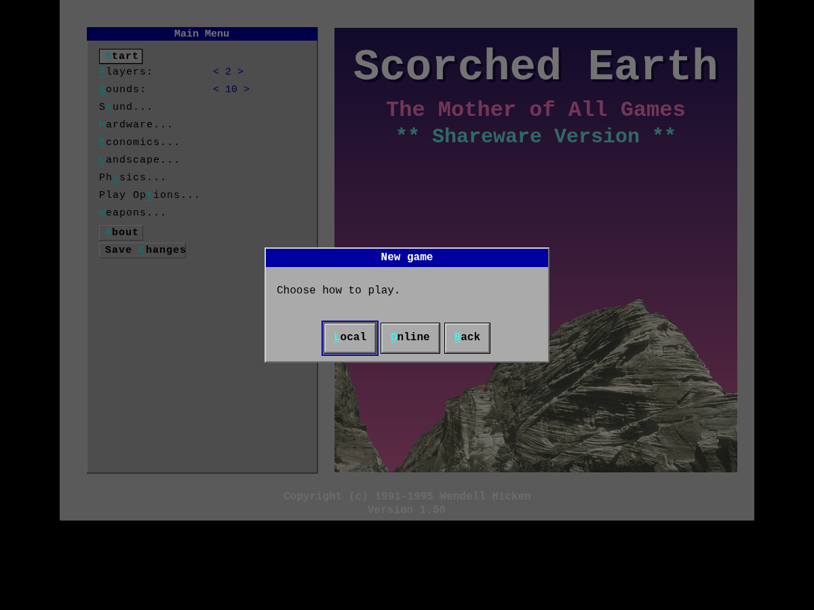
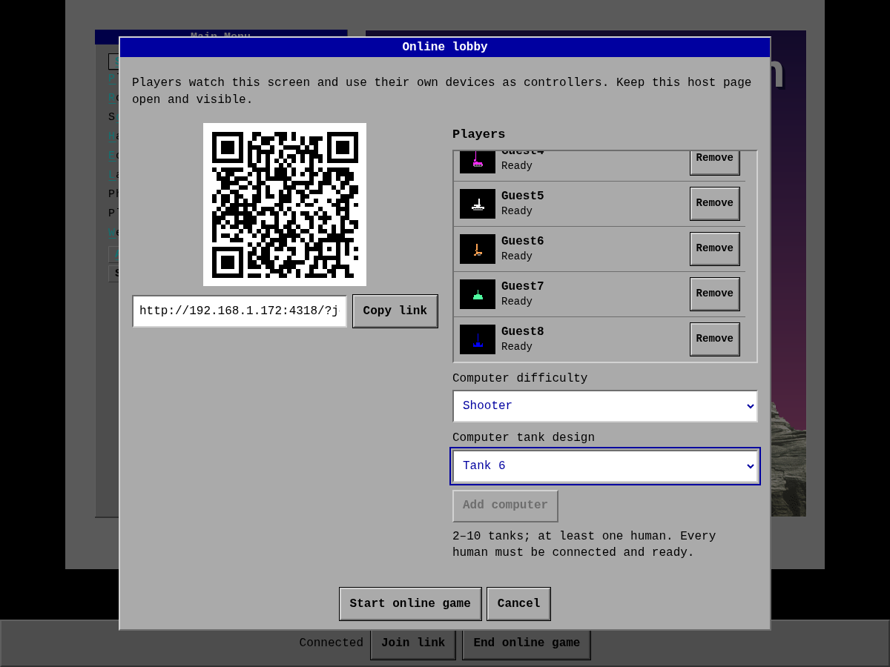

# Scorched Earth - Port

A browser reimplementation of **Scorched Earth v1.5** (1995, DOS) by **Wendell Hicken** -
"The Mother of All Games" - running natively on TypeScript + Canvas2D + Web Audio.
No plugins, no WASM, no Python or DOS runtime: open it and play.

### Play it now: https://scorched.gosuwachu.fyi/

Nothing to install - it is a static HTML5 page that runs in the browser.

It reproduces the original's turn-based tank artillery - destructible terrain, the
weapon shop, the computer players, the physics and wind, the economy and scoring -
reconstructed function-for-function and verified against the original's behavior.

## Screenshots

Captured from this TypeScript / Canvas port running in the browser:

|   |   |   |
|:---:|:---:|:---:|
| <br>Title screen | <br>Player and tank setup | <br>A turn in progress |
| <br>A shell detonates | <br>A direct hit | <br>The weapon shop |
| <br>In-game control panel | <br>Round rankings | <br>Final scoring |

## Credit: Wendell Hicken

Scorched Earth, subtitled "The Mother of All Games," was created by **Wendell Hicken**
and distributed as shareware for DOS. The original is Copyright (c) 1991-1995 Wendell
Hicken. All rights to Scorched Earth - its name, design, artwork, sound, terrain data,
and original code - belong to him. His site is `whicken.com`.

This project is an independent, **non-commercial tribute**. It is **not affiliated
with, endorsed by, or supported by Wendell Hicken**. The game design is entirely his;
this port only re-expresses its mechanics in TypeScript so the game can run in a
browser today. If you want the genuine article, seek out Wendell Hicken's original.

## How it was built, and how faithful it is

The original Scorched Earth DOS executable is the sole reference for behavioral
and visual fidelity. This project's history explains why some legacy tests still
refer to a Python port:

1. The original DOS binary was initially reverse-engineered **statically**
   into a function-for-function **Python/pygame port**
   ([scorchedearth-python](https://github.com/DigitalCyberSoft/scorchedearth-python)),
   using the recovered machine code as its reference.
2. This HTML5 build is a TypeScript rewrite of that Python port, with the Python port
   as its historical **oracle**. Agreement with that port does not by itself prove
   agreement with DOS. Funky Bomb, Sandhogs, and multi-layer terrain collapse now
   use corrected DOS-derived behavior; see [the evidence and limitations](oracle/WEAPON_FIDELITY.md).

Current verification uses:

- **DOS evidence:** fixtures extracted directly from the checked executable,
  independently transcribed routines, and recorded DOSBox runtime samples. Their
  provenance and limits are documented in [the combat audit](oracle/COMBAT_FIDELITY.md).
- **Browser checks:** Playwright drives the real simulation and renderer through
  controlled scenarios, captures successive frames, and checks actual DOM controls.
  See [the browser testing guide](test-browser/README.md).
- **Regression tests:** `npm test` covers DOS-backed mechanics, browser behavior
  and remaining legacy Python-derived fixtures. Those legacy results do not
  establish DOS fidelity. New reference comparisons use the original DOS game;
  the [Python visual comparison workflow](visual/README.md) is retired.

Tests against retained DOS fixtures do not require DOSBox or the executable.
New runtime captures use a disposable copy of the original game; see
[the DOS testing guide](oracle/dos/README.md). Runtime comparisons currently cover
documented cases and flight windows, not every encounter or a complete automated
frame-by-frame comparison of both games.

## Play

Open **https://digitalcybersoft.github.io/scorchedearth-html5/** in any modern browser.
There is nothing to install - it is a static HTML5 page (Canvas2D + Web Audio +
JavaScript). A short loading bar fetches the assets, then the menu appears.

Controls: Left/Right aim the turret, Up/Down adjust power, Tab cycles weapons,
Space or Enter fires, number keys select a tank, F11 toggles fullscreen, Esc backs
out. The menus, the weapon shop, and the in-game control panel (battery, parachute,
shield) are mouse-driven.

### Play together on a LAN

Choose **Online** in the new-game dialog to play together using phones or browsers
as tank controllers. Players scan the host's QR code or open the join link, choose
a name and tank, and get ready while everyone watches the battlefield on the host
screen. Each player controls aiming, firing, inventory, and purchases on their own
device, with controls enabled only on their turn. Reopening the original link in
the same browser restores their player, provided its storage is intact. Online
mode requires the LAN service below; the static hosted site supports Local play.





On the host computer, install Node.js 20 or later, then run:

```bash
npm ci
npm run lan
```

Open one of the printed host URLs, select **Start Game → Online**, and share the
lobby's QR code or join link. Everyone must be on a network that can reach the host
computer's port (3000 by default). The lobby generates its join link and QR code
automatically using the URL you opened, including a public VPS URL. When opened
through localhost, it uses the first detected LAN address. If the server prints
several LAN URLs, open the one on the same network as the players.
Set `PORT` before starting the server to use another port.

Players choose a name and tank on their phones or browsers and press **Ready**.
The host can add computer tanks, choose their difficulty, and start with 2–10 tanks
once all human players are connected and ready. The host can play using the same
join link on a separate controller page. **Local** retains the existing game setup.

Watch the battlefield on the host screen. Each controller shows its tank's status,
aiming and firing buttons, inventory, equipment, and purchasing controls. Choose
**Simultaneous** in Play Options before starting an online match to let everyone
aim and fire together. Each phone controls only its own tank with the same buttons;
no key rebinding is needed. Plasma battery choices appear only on the owner's phone
while the battle continues. Other online modes use sequential turns, where only
the active player can act. Purchasing always takes turns; each player presses
**Done**, and the host advances the shared round results
with **Continue to purchasing**. The existing round and match-ending rules apply.

Reopen the original join link in the **same browser, with its storage intact**, to
resume your tank, including during a round or shopping. Refreshing a controller is
safe. A second tab for the same player replaces the first. Disconnected players
keep their tank. Sequential turns wait for them; simultaneous battles continue,
with the disconnected tank's controls released. New players cannot join after Start.

Keep the host game page **open and visible**. It runs the game; the Node server
relays controls and serves the pages. A temporary network interruption reconnects
automatically, but refreshing/closing the host page or restarting the server does
not recover the match. Rooms without a host expire after five minutes. Keeping a
stable host address and port also keeps controller browser storage on the same origin.

For development, `npm run dev:lan` runs the LAN server with Vite on the same port.
`npm run start:lan` serves an existing build. `npm run test:online` runs the standalone
protocol tests; `npm run test:online:browser` runs the multiplayer browser checks
(install Chromium with `npx playwright install chromium`, or set `CHROMIUM_PATH`).
After building, `npm run test:online:production` checks the shipped pages and server.
The static hosted site supports Local play; Online requires this LAN service.

## Install on an Ubuntu VPS

The Debian package includes the compiled game, original assets, production
`node_modules`, and a private, checksum-verified Node.js 24.21.0 runtime. The VPS
does not need Node, npm, Docker, or a source checkout. Standard Ubuntu system
libraries and systemd are declared package dependencies; `apt` can install any
missing OS dependencies. Package installation never downloads JavaScript packages.

### Build and test the package

On an amd64 development machine with Docker access:

```bash
./packaging/build-and-test.sh
./packaging/build-and-test.sh --skip-tests  # build only, including type checking
```

The build runs inside Ubuntu 24.04. Tests install the resulting package in fresh
Ubuntu 24.04 and 25.04 containers without system Node/npm and with networking
disabled. They check assets, multiplayer/reconnect, invalid settings, port
conflicts, service-unit validity, upgrades, configuration preservation, removal,
and purge. An additional browser test exercises HTTPS and secure WebSockets through
Caddy's shared `sites.d` layout, alongside another application. The TLS certificate
is generated only for this isolated test; production uses Caddy's automatic HTTPS.
The deployment installer is also exercised with real package transactions and
game processes in both Ubuntu containers, using a service-control adapter in place
of systemd. Checks include same-version reinstallation, changed package defaults,
foreign port listeners, invalid uploads, and failed application health checks.

With tests enabled, successful completion prints `PASS`. Both modes leave these files:

```text
artifacts/scorchedearth-html5_0.0.0-1_amd64.deb
artifacts/SHA256SUMS
```

The package is approximately 33 MB. A runtime smoke test launches the service
command as its dedicated account with a test-only seccomp launcher enforcing the
packaged socket-family allowlist. It also denies `AF_NETLINK` to verify that failed
LAN discovery warns once and returns empty LAN URLs without breaking HTTP or
multiplayer. The service allows `AF_NETLINK` because Linux interface discovery
requires it. These tests do not emulate the complete systemd sandbox;
Docker does not run systemd as PID 1. Actual
service startup, reboot behavior, and public certificate issuance should also be
verified when deploying. The package build does not require the separate Python
oracle vectors. To run the deployment-client test alone:

```bash
node --test packaging/test-*.mjs
```

### Install the game

From the development checkout, deploy with one command:

```bash
./deploy.sh root@game.example.com
./deploy.sh admin@another-vps   # requires non-interactive sudo on the VPS
./deploy.sh --skip-tests admin@another-vps
```

An explicit SSH target is required; there is no default server. The script checks
SSH access, builds and tests a fresh package in Docker, verifies
its checksum, uploads it into a temporary directory, and installs it on the VPS.
It then enables/restarts `scorchedearth-html5.service` and verifies the installed
version, active service, and application health within 30 seconds. It works from
any current directory when invoked by its path.

`--skip-tests` may appear before or after the SSH target. It skips all test suites,
including those otherwise run during Docker image verification, and prints a
warning. It still builds a fresh package from the current source, runs TypeScript
checking and production bundling, and performs checksum, privilege, port, and
post-install health checks. It does not reuse an existing package instead of
building. Tests remain enabled by default. Both scripts support `--help`.

The destination must run matching-architecture Ubuntu with systemd. Deployment
preserves existing settings and reinstalls even an unchanged package version, so
rebuilding `0.0.0-1` still replaces the installed files. An unrelated listener on
the configured port causes deployment to fail before installation; the game's
own listener is allowed during upgrades. Package installation restarts the game
and interrupts active matches. Failures return a nonzero status, report service
diagnostics when installation has begun, and clean up uploads; there is no
automatic package rollback.

Caddy is deployed separately with `./deploy-caddy.sh` as described below. The game
deployment does not change DNS, firewall rules, or other applications.

For manual package transfer and installation:

This package defaults to **127.0.0.1:4001**. Before the first install, check that
4001 has no listener on your destination server:

```bash
ssh admin@game.example.com 'ss -H -ltn "( sport = :4001 )"'
scp artifacts/scorchedearth-html5_0.0.0-1_amd64.deb artifacts/SHA256SUMS admin@game.example.com:/tmp/
ssh admin@game.example.com
cd /tmp
sha256sum --check SHA256SUMS
sudo apt install ./scorchedearth-html5_0.0.0-1_amd64.deb
systemctl status scorchedearth-html5 --no-pager
curl --fail http://127.0.0.1:4001/api/lan
```

If the first command prints a listener, investigate it before installing; do not
replace another application's service. For upgrades, the game itself is expected
to own this port. The package enables the service at boot and starts it immediately,
running as `scorchedearth-html5` from `/opt/scorchedearth-html5`. Logs go to the journal:

```bash
journalctl -u scorchedearth-html5 -f
```

Settings live in `/etc/default/scorchedearth-html5` and survive upgrades. `HOST`
accepts an IPv4/IPv6 bind address, and `PORT` accepts 1–65535. Restart the service
after editing settings. If changing the port, also change the Caddy upstream below
and redeploy that configuration. The backend remains private on loopback; no
public firewall opening for port 4001 is needed.

### Deploy the HTTPS site

The shared proxy is provisioned separately by
[`caddy-reverse-proxy`](../caddy-reverse-proxy). This application expects an active
`caddy.service` and `/usr/local/sbin/caddy-config` on the VPS. It does not install
or manage a second proxy. Create a DNS A record for your game domain pointing to
your server's public IP before requesting its public certificate. Replace the
example SSH targets and `scorched.example.com` below with your own values.

The game owns the template [deploy/caddy/scorchedearth-html5.caddy](deploy/caddy/scorchedearth-html5.caddy).
From this checkout on the workstation, deploy just that site:

```bash
./deploy-caddy.sh root@game.example.com scorched.example.com
./deploy-caddy.sh admin@my-vps scorched.example.com  # requires non-interactive sudo
```

Both the SSH target and domain are required. The domain must be a DNS hostname,
without a scheme, port, path, or wildcard. The script replaces `__SITE_DOMAIN__`
locally, streams the rendered configuration to a temporary upload, and invokes
`caddy-config deploy scorchedearth-html5`. The shared helper validates the combined
configuration, installs `/etc/caddy/sites.d/scorchedearth-html5.caddy`, and gracefully
reloads Caddy. It preserves other applications and rolls back on reload failure.
The script returns a failure if upload, validation, or reload fails. The shared
proxy repository does not need to be checked out on the workstation.

For installation from the `.deb` alone, a copy of the template is included.
Render it with your domain before passing it to Caddy:

```bash
# On the VPS:
site=$(mktemp)
sed 's/__SITE_DOMAIN__/scorched.example.com/g' \
  /usr/share/scorchedearth-html5/caddy/scorchedearth-html5.caddy > "$site"
sudo caddy-config deploy scorchedearth-html5 "$site"
rm -f -- "$site"
curl --fail https://scorched.example.com/
systemctl status caddy --no-pager
journalctl -u caddy --since '-5 minutes' --no-pager
```

Open your game domain (for example, **https://scorched.example.com**), choose Online, and connect a controller using
the generated join link. It retains the public HTTPS origin and uses secure
WebSockets. The host browser still runs the game and must stay open; the VPS relays
messages. Restarting/upgrading the game service loses its in-memory rooms. Caddy
reloads may briefly disconnect WebSockets, which reconnect automatically.

Install a newer `.deb` with the same `apt install ./…deb` command. To remove the
site and game, run on the VPS:

```bash
sudo caddy-config remove scorchedearth-html5
sudo apt remove scorchedearth-html5  # retain service settings
# Or: sudo apt purge scorchedearth-html5  # also remove service settings
```

Proxy configuration is deployed independently and is never changed by game package
maintenance scripts. The system account is retained after removal to avoid UID reuse.

## Building from source (developers only)

The game is written in TypeScript and compiled **once** to the browser JavaScript that
ships above; players never run any of this. It is only for modifying the code.

```bash
npm install
npm run dev          # dev server at http://localhost:5173
npm run build        # static bundle into dist/ (what GitHub Pages serves)
npm test             # DOS-backed tests and remaining legacy regression coverage
```

## The original assets

This repository **includes** Wendell Hicken's original v1.5 data files under
`public/assets/` - the 10 `.MTN` digitized mountains, `TALK1.CFG` / `TALK2.CFG` tank
taunts, and `SCORCH.ICO` - so the game plays with the genuine landscapes and taunts out
of the box. **These files are Wendell Hicken's property**, included only to keep this
tribute faithful and immediately playable; they are not the authors' to license. The
engine also runs without them (procedural terrain, gradient title, no taunts).

## How the code is organized

| Module | Reverses |
|--------|----------|
| `rng.ts` | CPython Mersenne Twister, bit-exact (the determinism linchpin) |
| `constants.ts` | byte-verified physics / damage / scoring / color-band constants |
| `terrain.ts` | the pixel framebuffer, terrain generation, carve / deposit / settle |
| `physics.ts` | the projectile integrator (gravity, wind, viscosity, speed clamp) |
| `weapons.ts`, `weapon_behaviors.ts` | the 48-item table; rollers, diggers, MIRV, laser, riot |
| `damage.ts`, `death.ts`, `hazard.ts` | radial damage, shields, fall damage, death throes, sky hazards |
| `ai.ts`, `guidance.ts` | the seven computer types and the aiming oracle |
| `economy.ts`, `scoring.ts` | the free-market shop, interest, scoring and rankings |
| `game.ts` | the round / turn loop, fire / impact pipeline, win test |
| `pygame.ts` | a faithful pygame API over Canvas2D (Surface, draw, surfarray, font) |
| `render.ts`, `ui.ts`, `widgets.ts`, `screens.ts`, `ingame.ts` | rendering, HUD, menus, shop, dialogs |
| `sprites.ts`, `palette.ts`, `sound.ts` | the recovered art + `.MTN` decoder, color tables, Web Audio |
| `mtn.ts` | the `.MTN` terrain-photo decoder |
| `main.ts` | the requestAnimationFrame loop, input, state machine, asset boot, IndexedDB saves |

`oracle/` holds DOS capture/extraction tools, evidence and legacy dumpers; `test/`
the automated suite; `test-browser/` the browser checks; `visual/` the retired
Python-port comparison scripts.

## License and use

The TypeScript, HTML, and CSS authored in this repository are the authors' own work
and grant no rights to Scorched Earth itself. Game mechanics and rules, as distinct
from a specific implementation, are generally understood not to be protected by
copyright in the US; this port reimplements only the mechanics. Scorched Earth, its
name, and all of its assets remain the property of Wendell Hicken. Please treat this
as a personal, non-commercial tribute for play and study.
