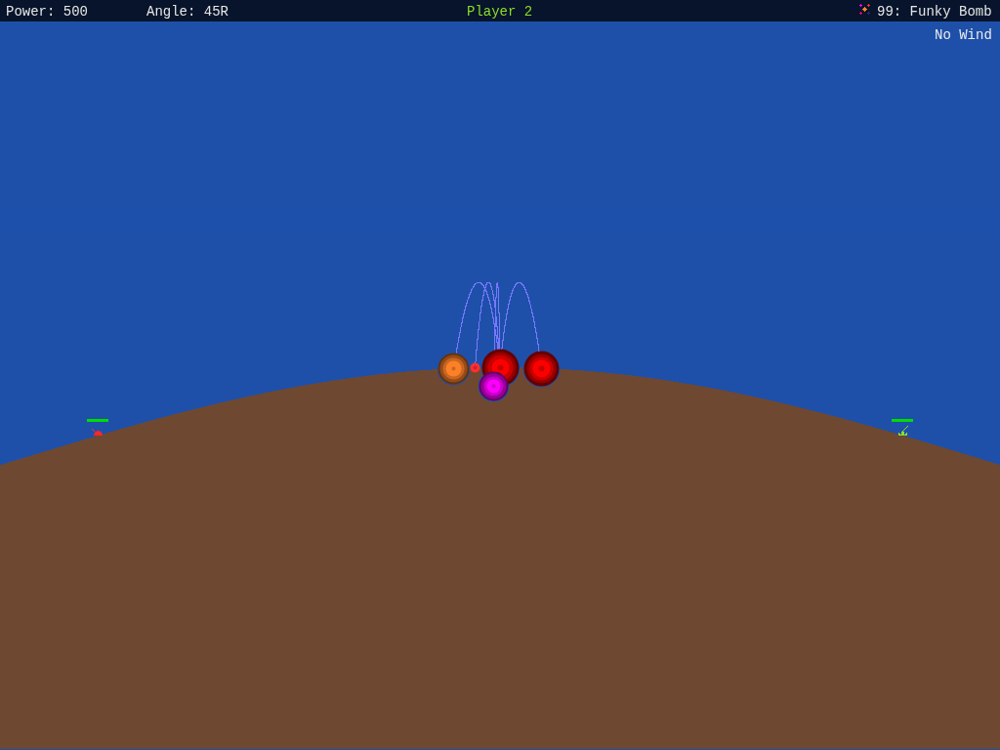
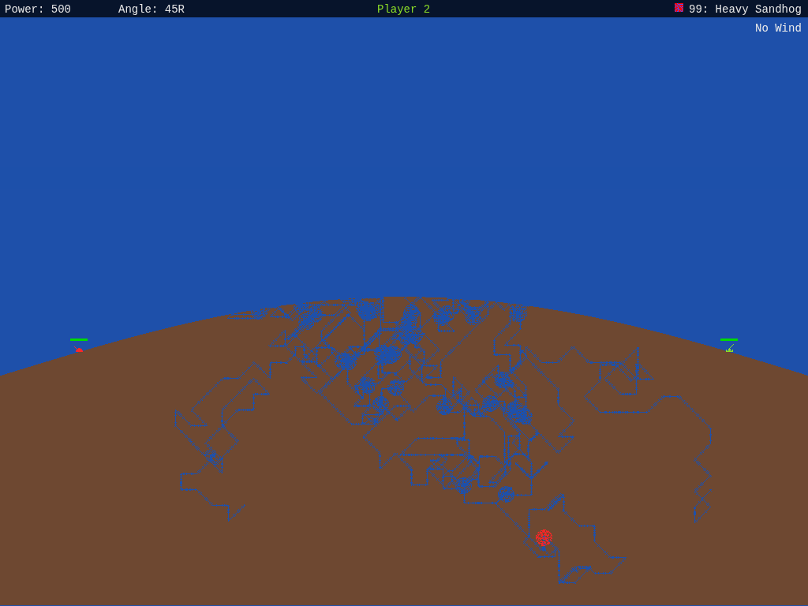
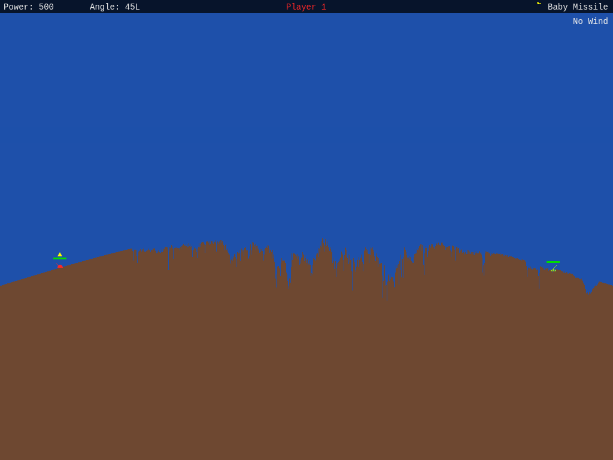

# Funky Bomb, Sandhogs, and terrain collapse

These corrections use Scorched Earth 1.5's actual weapon dispatch table and
handlers. The earlier Python-derived implementation attributed Funky Bomb to a
laser routine and Sandhog to an unrelated target selector. Its differential
vectors reproduced those mistakes, so they cannot validate these corrections.

## Reference and address convention

The locally installed `SCORCH.EXE` is 415,456 bytes, SHA-256
`05e4a11643ec7055b1c811531a73c5b4f5c67c463612f3e4910e557301c3179f`.
It matches the executable in the local `scorch15.zip` archive. The installed
executable and configuration were left unchanged.

Addresses below use the existing analysis convention: add `0x1000` to a stored
code segment. For these routines, a code address maps to file offset
`0x6a00 + (segment - 0x1000) * 16 + offset`; data segment `5f38` starts at
file offset `0x55d80`. Borland's `INT 34..3b` floating-point instructions must be
decoded at instruction boundaries, not by replacing matching bytes throughout
the executable.

The weapon table at `DS:1200` has 52-byte entries:

| Item | Handler | Base value | Meaning |
| --- | --- | --- | --- |
| Funky Bomb (5) | `2dce:0000` | 80 | Horizontal destination range |
| Baby Sandhog (22) | `251b:000a` | 10 | Total tunnel births |
| Sandhog (23) | `251b:000a` | 20 | Total tunnel births |
| Heavy Sandhog (24) | `251b:000a` | 35 | Total tunnel births |

## Recovered behavior

Funky Bomb starts with a colored radius-20 burst, then sends 5–10 curved trails
to destinations within 80 pixels horizontally of the impact. These use the
signed 16.16 recurrence at `2dce:05df..0820`, rather than ballistic projectiles or
instantaneous scatter explosions. Trails stop at terrain, tanks, or field edges.
Their landing bursts have scaled radii of 15–24. The five VGA color ramps come
from `DS:1f62`; the colored circles remain during the palette cycle. Cleanup ends
with the ordinary scaled radius-40 blast referenced at `2dce:05c5`. A shield
intercepts the original projectile with a 10-point chip and no chain.

The fired range is exactly `x + random(160) - 80`, clipped to the field, and
does not scale with resolution or explosion size. The Funky tank-death case
(`271b:01f2`) instead passes -1 to `2dce:01b4`; its branch at `01e9` picks
destinations across the entire clip width, with the right endpoint exclusive.
These two modes now have separate callers. The fixed pixel range naturally
occupies a smaller fraction of a wider browser battlefield.

Sandhogs follow available neighboring dirt instead of homing on a tank. The
direction and widening tables are at `DS:0ad6` and `DS:0af6`. `251b:03f1` consumes
a direction choice, then applies direction persistence with a 20-step counter.
`251b:0665` widens tunnels randomly, advances the heads, and creates a branch
every eight eligible ticks. There are at most 20 live heads; the table values
above limit total births. A head without neighboring dirt fires a charge and
retires. `251b:017f` applies rounded radial damage multiplied by item index + 1;
the radius is `10 * explosion_scale` (`DS:0b1c`). Charges briefly paint red stipple
and remove those pixels. Direct tank contact chips 10 points; a shield absorbs
the chip without spilling damage into the hull.

Terrain settling waits for the weapon effect to finish. The old implementation
dropped only the first dirt run in each column, leaving deeper Sandhog tunnels
open. In the executable, `2a1e:01e6` scans through and merges dirt below the falling
run, and `2a1e:0234..024a` calls `0059` again to find another suspended run.
The corrected port compacts all unsupported layers to their resting positions,
preserving dirt quantity and shade order. The existing Suspend Dirt probability
gate remains in effect. This fixes the shared settling routine for other
explosions too.

## Reproduce the checks

```bash
python oracle/extract_weapon_reference.py /path/to/SCORCH.EXE
npm test
npm run build

# With npm run dev in another terminal:
node test-browser/run.mjs http://localhost:5173
node test-browser/weapons.mjs http://localhost:5173
```

The extractor requires the checksum above. It reads table values, direction
tables, colors, and charge constants directly. Its curve vectors independently
transcribe the fixed-point recurrence; its collapse vectors describe terminal
column geometry using one-pixel falling steps. These are static-analysis
fixtures, **not recorded DOS execution traces**. They are checked in at
`test/fixtures/dos_weapons.json`, so ordinary tests need no original executable.

`test/weapon_effects.test.ts` checks exact curve pixels, tunnel budgets, branching,
charges, direct contact, ownership, deterministic replay, effect lifetime, volley
integration, and complete collapse after all three Sandhogs. The separate
`test/terrain_collapse.test.ts` checks complete resting columns, fixed supports,
shade conservation, idempotence, affected ranges, and Suspend Dirt gating.
Historical Python expectations for the corrected behavior are superseded, not
silently regenerated from the TypeScript implementation.

The browser harness exercises all four weapons on flat and hilly terrain,
checks completion and page errors, verifies that no unsupported dirt remains,
and saves intermediate and settled screenshots under `test-browser/out/weapons/`.

| Funky Bomb | Heavy Sandhog tunnels | After terrain collapse |
| --- | --- | --- |
|  |  |  |

## Visual reference and limits

DOSBox 0.74-3 was also run against a temporary copy, with a software SDL surface
and fixed 20,000 cycles. To make reference shots available without shopping,
the temporary Baby Missile entry's handler and base value (its first six bytes)
were replaced with the selected weapon's entry. The weapon handlers themselves
were unmodified. Those captures demonstrate the colored Funky trails and bursts,
branching Sandhog tunnels, and subsequent collapse. Their HUD still says Baby
Missile and their item-index-dependent damage is **not** a valid damage reference.
No DOS executable or modified executable is distributed here.

The port retains its seeded Mersenne Twister rather than DOS's RNG, so equal seeds
do not produce equal DOS and browser shots. Browser cadence is fixed: 16 tunnel
ticks per frame; Funky growth advances 3 pixels and curves up to 64 distinct
pixels per frame. This adapts DOS's CPU-dependent timing. Terrain collapse still
resolves to the resting geometry in one update rather than animating each falling
pixel. Canvas circle rasterization, the separate terrain/effect planes, and
preserved dirt shades also prevent a claim of pixel-identical VGA output.
